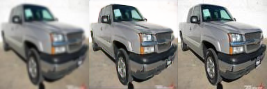
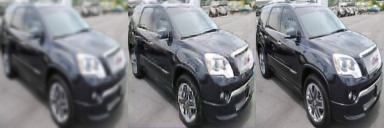

# superresolution-gan
A DCGAN implementation in Tensorflow for super-resolution of 64 x 64 RGB images to 128 x 128 ones.

# Notes on dataset

Worked on the car dataset from [ai.stanford.edu](http://ai.stanford.edu/~jkrause/cars/car_dataset.html).
Reason why I preferred this dataset is to maintain the coherence between images.
After cropping images according to bounding boxes, eliminated the ones with ```height < 128``` or ```width < 128```, resized them roughly to ```128 x 128 x 3``` images.
Splitting some of them randomly for test, 4D ```.npy```s with shape **[size, 128, 128, 3]** are used in training and test scripts.

# Usage

All python scripts have related arguments in order to set hyperparameters, model names, directories etc. and all the information about usage of each script can be seen with ```--help```.

An example usage lies below.

# Downloading and Preparing Dataset

Run the script to download dataset:

```
sh downloadAndExtract.sh
```

Then run the script,

```
python3.5 prepare.py
```

to prepare the dataset before calling,

```
python3.5 imgs2npys.py
```

which creates actual training and test sets stored in numpy arrays.

# Training and Test

To train a model, run:

```
python3.5 train.py --model=new_model -save-every=1
```

This script will train the model and save it under the ```model/```  directory.

To test a trained model, run:

```
python3.5 test.py --model=new_model
```

Test script will restore the model from ```model/``` and run on the images residing in ```test_rgb.npy```.
Then it will create test output images in ```test_out_imgs%Y%m%d-%H%M%S/```. 

**Note**: superresolution-gan comes with a pre-trained model named as ```default```. Images below are generated with this model.

# Example test outputs

Left to right, test output images' format is like this:
 - after rough super-resolution with ```scipy.misc.imresize(img, size=(128, 128, 3))```,
 - after super-resolution with **superresolution-gan**,
 - original ```128 x 128 x 3``` image
 
 
 
 
 
 
 
 
 

